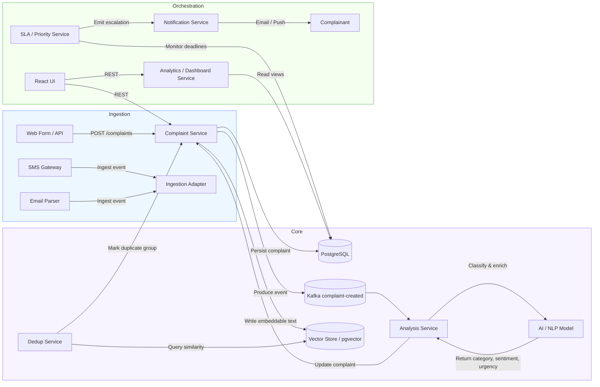

# AI Complaint Intelligence Platform

## Overview
This repository is a BMAD microservice prototype for an intelligent complaint management system.
It targets complaint intake, AI classification, duplicate detection, priority routing, and analytics.

- **B — Business domains**
  - Complaint intake and tracking
  - AI-driven classification and sentiment analysis
  - Priority/SLA routing and escalation
  - Real-time dashboards and notifications
  - Transactional storage for audit and reporting

- **M — Microservices**
  - `services/complaint-service`: complaint CRUD, status, and persistence
  - `services/analysis-service`: AI/NLP classification service skeleton
  - `frontend/`: React/Vite user interface
  - `postgres`: PostgreSQL database for complaint storage

- **A — APIs / communication**
  - `complaint-service` exposes REST endpoints for complaint creation, retrieval, and updates
  - `analysis-service` is meant to handle classification and enrichment asynchronously
  - `frontend` interacts with backend APIs and displays complaint dashboards

- **D — Data**
  - PostgreSQL stores complaints, statuses, and audit metadata
  - Future expansion can add pgvector / Elasticsearch for semantic deduplication and search
  - Kafka or event streaming can be introduced for ingestion and asynchronous processing

## Project structure

- `docker-compose.yml` — service composition for backend, frontend, and database
- `frontend/` — React app built with Vite
- `services/complaint-service/` — Spring Boot complaint API microservice
- `services/analysis-service/` — Spring Boot analysis service skeleton
- `pom.xml` — root Maven aggregator

## System architecture

This platform follows an event-aware microservice pattern with a clean separation of intake, classification, persistence, and presentation.

### Architecture diagram



### Component responsibilities

- `frontend`
  - complaint submission UI
  - complaint list, detail, and dashboard views
  - status updates and filtering

- `complaint-service`
  - transactional complaint CRUD
  - complaint lifecycle state
  - persistence in PostgreSQL

- `analysis-service`
  - AI/NLP enrichment of complaint text
  - category, sentiment, urgency classification
  - asynchronous processing to keep ingest fast

- `postgres`
  - canonical complaint storage
  - audit history and SLA state

## Complaint service packages

- `model` — JPA entities and enums
- `repository` — Spring Data repositories
- `dto` — request and response DTOs
- `service` — business logic and classification rules
- `controller` — REST APIs
- `exception` — global exception handling

## APIs

### Complaint service

- `POST /complaints`
  - Create a complaint
  - Request body: `title`, `description`, `sector`, `source`

- `GET /complaints/{id}`
  - Get complaint by ID

- `GET /complaints`
  - Get all complaints

- `PATCH /complaints/{id}/status`
  - Update complaint status
  - Request body: `status`

## How to run

### Prerequisites

- Docker & Docker Compose
- Java 17 or newer for local Maven builds
- Maven

### Start with Docker Compose

```bash
docker compose up --build
```

This will start:
- `complaint-service` on port `8080`
- `analysis-service` on port `8081`
- `frontend` on port `4173`
- `postgres` on port `5432`

### Run complaint service locally

```bash
cd services/complaint-service
mvn spring-boot:run
```

If running locally, ensure Postgres is available and environment variables are set:

```bash
set SPRING_DATASOURCE_URL=jdbc:postgresql://localhost:5432/complaintsdb
set SPRING_DATASOURCE_USERNAME=ai_user
set SPRING_DATASOURCE_PASSWORD=ai_pass
```

## Notes

- The complaint classification currently uses keyword rules and can be replaced later with AI/NLP logic.
- Tests are configured with JUnit 5, Mockito, and Testcontainers for PostgreSQL integration.
- The root Maven `pom.xml` is an aggregator that includes service modules.

## Next improvements

- Add `analysis-service` endpoints for asynchronous complaint processing
- Add API security / authentication
- Add dashboard analytics endpoints and UI integration
- Replace rule-based classification with an NLP/AI model
- Add architecture documentation in `ARCHITECTURE.md` for BMAD design, phase planning, and service decomposition

## Architecture reference

For a concrete system design, see [ARCHITECTURE.md](ARCHITECTURE.md).
